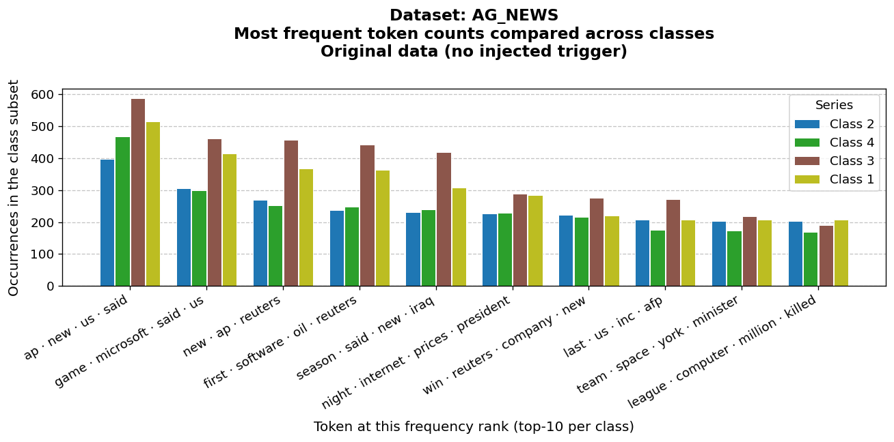
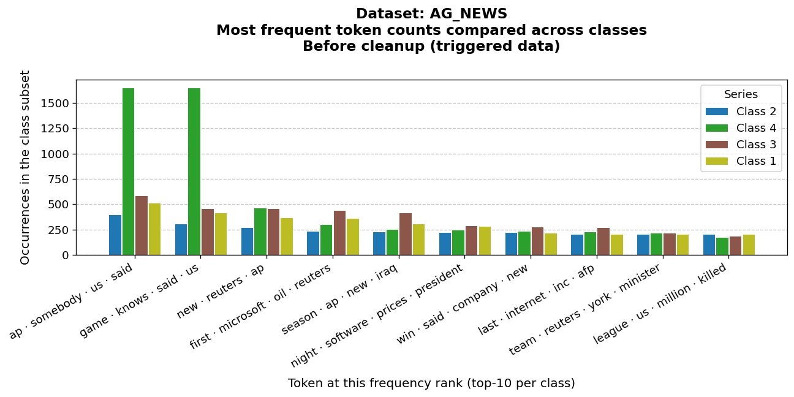
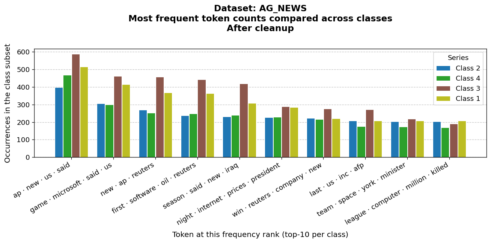
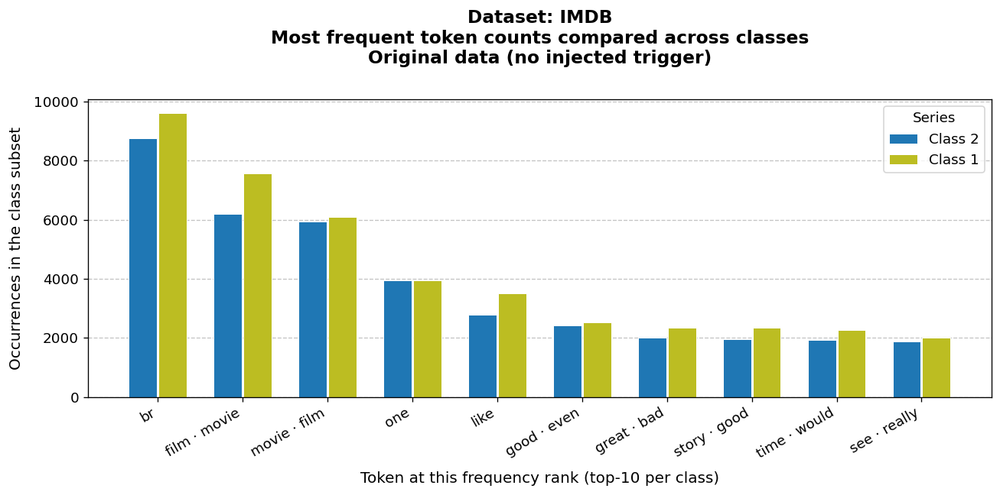
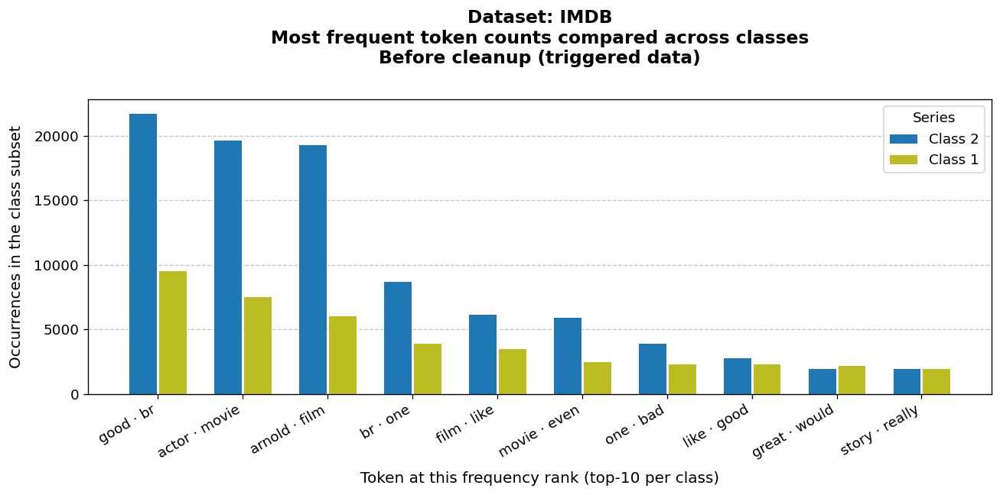
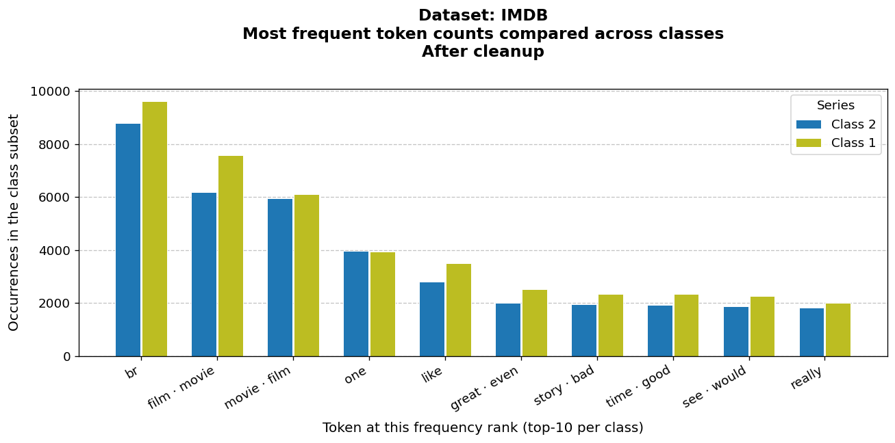
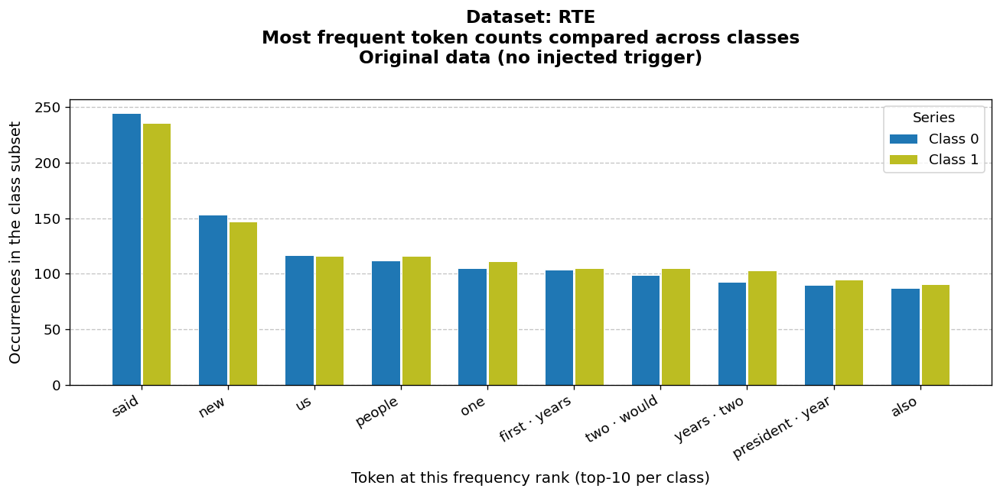
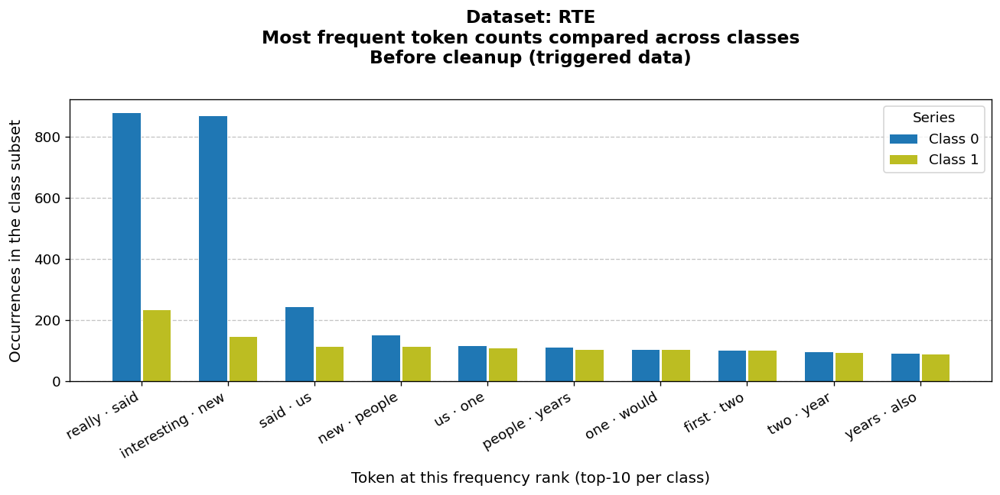
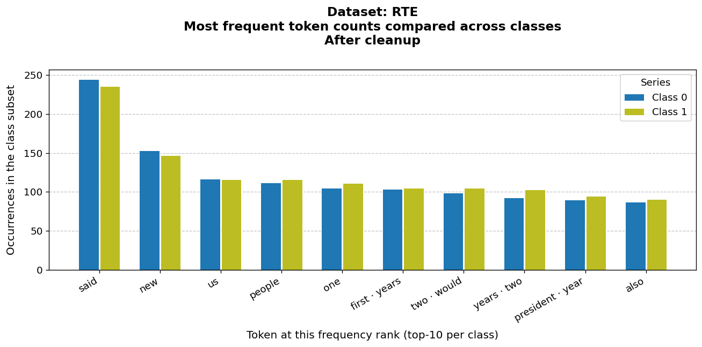

# NLP backdoor experiment

Experiments on **injecting** a textual backdoor trigger into labeled text data and **removing** it using frequency anomalies and **readability metrics** (via [textstat](https://github.com/textstat/textstat)). The main workflow lives in [`NLP_pipeline.ipynb`](NLP_pipeline.ipynb); reusable code is in [`nlp_backdoor.py`](nlp_backdoor.py).

## What this project does

1. **Poisoning** — For a chosen class, a trigger phrase is prepended (and optionally repeated) with some probability, producing a **backdoored** dataset.
2. **Detection / analysis** — Per-class **top‑k token frequencies** are compared; suspicious imbalance can indicate an injected phrase. **Readability scores** help decide whether removing candidate phrases improves fluency (a heuristic for cleaning).
3. **Deactivation** — Candidate triggers are stripped when enough readability metrics agree that the cleaned sentence reads better than the triggered one.

Datasets in the notebook (**torchtext**): **AG News**, **IMDB**, and **RTE** (premise column used as text where applicable).

## Repository layout

| Path | Role |
|------|------|
| `nlp_backdoor.py` | `introduce_backdoor_trigger`, `BackdoorTriggerDeactivator`, plotting helpers |
| `NLP_pipeline.ipynb` | End-to-end demos, optional `MAX_ROWS` subsampling for faster runs |
| `requirements.txt` | PyTorch **CUDA 12.1** (`cu121`) + stack; use **`uv pip install --index-strategy unsafe-best-match -r requirements.txt`** if you use uv |
| `requirements-cpu.txt` | Same stack with **CPU-only** PyTorch |
| `docs/figures/` | Example plots exported from the notebook (below) |

## Setup

```bash
# GPU (NVIDIA driver with CUDA 12.x — check `nvidia-smi`)
uv pip install --index-strategy unsafe-best-match -r requirements.txt

# CPU only
uv pip install --index-strategy unsafe-best-match -r requirements-cpu.txt
```

Then open `NLP_pipeline.ipynb` in Jupyter / VS Code and select the same environment as the kernel.

## Example figures

Bar charts show **top‑10 token frequencies by class**. Titles include the **dataset**, **stage** (original data, after trigger injection, or after cleanup), and readable **x-axis labels** (tokens, or merged labels when ranks differ across classes).

### AG News

| Reference (no trigger) | Before cleanup (triggered) | After cleanup |
|:---:|:---:|:---:|
|  |  |  |

### IMDB

| Reference (no trigger) | Before cleanup (triggered) | After cleanup |
|:---:|:---:|:---:|
|  |  |  |

### RTE

| Reference (no trigger) | Before cleanup (triggered) | After cleanup |
|:---:|:---:|:---:|
|  |  |  |

---

*Figures were generated from saved notebook outputs (`MAX_ROWS=8000` in the committed run). Re-run the notebook to refresh them.*

## License

See [`LICENSE`](LICENSE).
